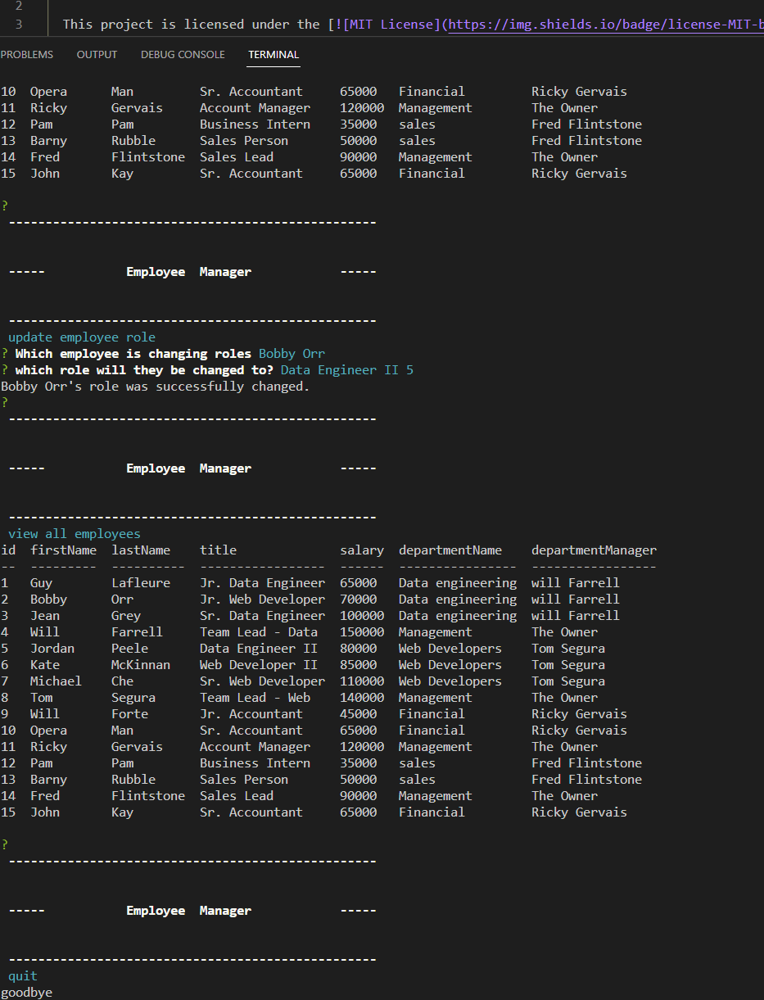

# Jolly-Thimble

  This project is licensed under the  .
    
  ## Description:
  This project creates a comand line based employee tracker. This app can view departments roles and employees all seperately. it can add new departments, roles, employees and even modify the current role of an employee. this uses technologies such as mysql, javascript, node.js, inquirer and console.table.
      
      
  ## Table of contents
  * [Description](#description)
  * [Screenshots](#screenshots)
  * [Installation](#installation)
  * [Usage](#usage)
  * [License](#license)
  * [Contributing](#contributing)
  * [Questions](#questions)
      

  ## Screenshots

the video can be viewed from [here](https://drive.google.com/file/d/1kgEVXZ4rlHvSlFphjS7dmx4DTon9qIE2/view)

  ## Installation
  npm install
  ## Usage
  this could be used with an old IBM computer to track employees using a seperate database.
  ## License
  MIT License

      Copyright (c) [2022] [Fraser Kennedy]
      
      Permission is hereby granted, free of charge, to any person obtaining a copy
      of this software and associated documentation files (the "Software"), to deal
      in the Software without restriction, including without limitation the rights
      to use, copy, modify, merge, publish, distribute, sublicense, and/or sell
      copies of the Software, and to permit persons to whom the Software is
      furnished to do so, subject to the following conditions:
      
      The above copyright notice and this permission notice shall be included in all
      copies or substantial portions of the Software.
      
      THE SOFTWARE IS PROVIDED "AS IS", WITHOUT WARRANTY OF ANY KIND, EXPRESS OR
      IMPLIED, INCLUDING BUT NOT LIMITED TO THE WARRANTIES OF MERCHANTABILITY,
      FITNESS FOR A PARTICULAR PURPOSE AND NONINFRINGEMENT. IN NO EVENT SHALL THE
      AUTHORS OR COPYRIGHT HOLDERS BE LIABLE FOR ANY CLAIM, DAMAGES OR OTHER
      LIABILITY, WHETHER IN AN ACTION OF CONTRACT, TORT OR OTHERWISE, ARISING FROM,
      OUT OF OR IN CONNECTION WITH THE SOFTWARE OR THE USE OR OTHER DEALINGS IN THE
      SOFTWARE.
  ## Contributing
  there is extra functionality that could be added like modifying managers in a simpler manner.
  
  ## Questions
  For questions please contact: Fraser Kennedy
  at  [ydennekrf@gmail.com](mailto:ydennekrf@gmail.com)
  Github Profile: [ydennekrf](https://github.com/ydennekrf) 